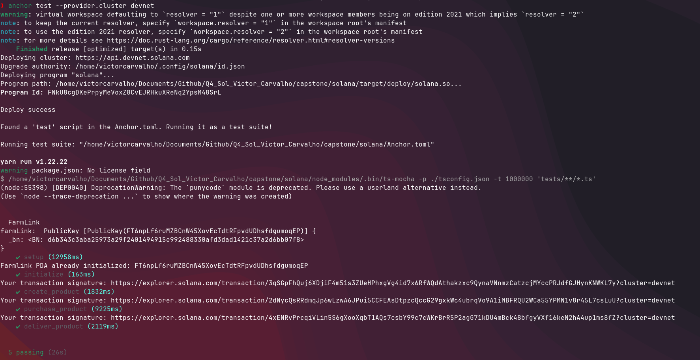

### Deployed Program(Devnet)
[3vJaEJMGZ6yiRtpxgctoxqnsUu73PRUJP5tJAUyCVPRX](https://explorer.solana.com/address/3vJaEJMGZ6yiRtpxgctoxqnsUu73PRUJP5tJAUyCVPRX?cluster=devnet)

### Instructions URL generated by the tests
{: style="width: 50%; display: block; margin: 0 auto;"}
- [Setup](https://explorer.solana.com/transaction/3qSGpFhQuj6XDjiF4m51s3ZUeHPhxgVg4id7x6RfWQdAthakzxc9QynaVNnmzCatzcjMYccPRJdfGJHynKNWKL7y?cluster=devnet)
- [Initialize](https://explorer.solana.com/transaction/2dNycQsRRdmqJp6wLzwA6JPui5CCFEAsDtpzcQccG29gxkWc4ubrqVo9A1iMBFRQU2WCa55YPMN1v8r45L7csLuU?cluster=devnet)
- [Create Product](https://explorer.solana.com/transaction/4xENRvPrcqiVLin5S6gXooXqbT1AQs7csbY99c7cWKrBrR5P2agG71kDU4mBck48bfgyVXf16keN2hA4up1ms8fZ?cluster=devnet)
- [Purchase Product](https://explorer.solana.com/transaction/4xENRvPrcqiVLin5S6gXooXqbT1AQs7csbY99c7cWKrBrR5P2agG71kDU4mBck48bfgyVXf16keN2hA4up1ms8fZ?cluster=devnet)
- [Deliver Product](https://explorer.solana.com/transaction/4xENRvPrcqiVLin5S6gXooXqbT1AQs7csbY99c7cWKrBrR5P2agG71kDU4mBck48bfgyVXf16keN2hA4up1ms8fZ?cluster=devnet)

### How to Run the Tests (Localnet)

Uncomment the following code block to generate new keypairs for testing in localnet:

```javascript
//////////////// Commented because in Devnet the airdrop limit can be reached (Uncomment if testing in localnet and comment the 3 loadKeyPairs accounts in lines 101, 102 and 103) ///////////////
// let farmer = Keypair.generate();
// let consumer = Keypair.generate();
// let payer = Keypair.generate();
///////////////////////////////////////////////////////////////////////////////////////////////////////////////////////////////////////////////////////////////////////////////////////////////
```

Comment the following code block to use pre-loaded keypairs for testing in localnet:

```javascript
const farmer = loadKeypair("./keypair-farmer.json");
const consumer = loadKeypair("./keypair-consumer.json");
const payer = loadKeypair("./keypair-payer.json");
```

Uncomment the following code block to request airdrops for the keypairs in localnet:

```javascript
//////////////// Commented because in Devnet the airdrop limit can be reached (Uncomment if testing in localnet) ///////////////
// await connection.confirmTransaction(
//   await connection.requestAirdrop(
//     farmer.publicKey,
//     0.1 * LAMPORTS_PER_SOL
//   ),
//   "confirmed"
// );
// await connection.confirmTransaction(
//   await connection.requestAirdrop(
//     consumer.publicKey,
//     0.1 * LAMPORTS_PER_SOL
//   ),
//   "confirmed"
// );
// await connection.confirmTransaction(
//   await connection.requestAirdrop(
//     payer.publicKey,
//     0.2 * LAMPORTS_PER_SOL
//   ),
//   "confirmed"
// );
//////////////////////////////////////////////////////////////////////////////////////////////////////////////////////////////
```

To run the tests in localnet, follow these steps:

1. Open a terminal.
2. Change the directory to `capstone/solana`.
3. Run the following command to start the Solana test validator and deploy the metaplex token metadata program:

```bash
solana-test-validator --bpf-program metaqbxxUerdq28cj1RbAWkYQm3ybzjb6a8bt518x1s tests/metaplex_token_metadata_program.so
```

4. Open another terminal.
5. Change the directory to `capstone/solana`.
6. Run the following command to run the tests using the Anchor framework(using the local validator running in the other terminal):

```bash
anchor test --skip-local-validator
```

### How to Run the Tests (Devnet)

Comment the following code block to generate new keypairs for testing in devnet:

```javascript
//////////////// Commented because in Devnet the airdrop limit can be reached (Uncomment if testing in localnet and comment the 3 loadKeyPairs accounts in lines 101, 102 and 103) ///////////////
// let farmer = Keypair.generate();
// let consumer = Keypair.generate();
// let payer = Keypair.generate();
///////////////////////////////////////////////////////////////////////////////////////////////////////////////////////////////////////////////////////////////////////////////////////////////
```

Uncomment the following code block to use pre-loaded keypairs for testing in devnet:

```javascript
const farmer = loadKeypair("./keypair-farmer.json");
const consumer = loadKeypair("./keypair-consumer.json");
const payer = loadKeypair("./keypair-payer.json");
```

Comment the following code block to skip requesting airdrops for the keypairs in devnet:

```javascript
//////////////// Commented because in Devnet the airdrop limit can be reached (Uncomment if testing in localnet) ///////////////
// await connection.confirmTransaction(
//   await connection.requestAirdrop(
//     farmer.publicKey,
//     0.1 * LAMPORTS_PER_SOL
//   ),
//   "confirmed"
// );
// await connection.confirmTransaction(
//   await connection.requestAirdrop(
//     consumer.publicKey,
//     0.1 * LAMPORTS_PER_SOL
//   ),
//   "confirmed"
// );
// await connection.confirmTransaction(
//   await connection.requestAirdrop(
//     payer.publicKey,
//     0.2 * LAMPORTS_PER_SOL
//   ),
//   "confirmed"
// );
//////////////////////////////////////////////////////////////////////////////////////////////////////////////////////////////
```

The comment and uncomment sections are necessary to provide accounts with sufficient balance for testing purposes. This eliminates the need for airdrops and reduces the risk of reaching the airdrop limit.

To run the tests in devnet, follow these steps:

1. Change the directory to `capstone/solana`.
2. Run the following command to run the tests using the Anchor framework with the devnet cluster:

```bash
anchor test --provider.cluster devnet
```

